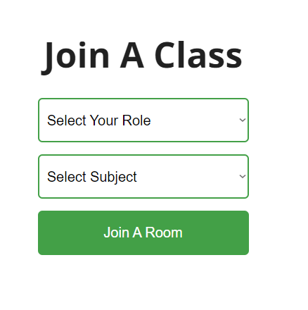

# CSC3104-Project
## How to start
### Prerequisites
- Docker
- Kubernetes (Docker desktop)

### Windows Configuration
To build the docker image, run the following command in the root directory of the project:
```
cd cloud\chatroom
apply.bat
```
To build the kubernetes server, run the following command in the root directory of the project:
```
cd cloud\backend
apply.bat
```
To build the kubernetes client, run the following command in the root directory of the project:
```
cd cloud\client
apply.bat

```

### Mac Configuration
To build the docker image, run the following command in the root directory of the project:
```
cd cloud/chatroom
bash apply.sh
```
To build the kubernetes server, run the following command in the root directory of the project:
```
cd cloud/backend
bash apply.sh
```
To build the kubernetes client, run the following command in the root directory of the project:
```
cd cloud\client
bash apply.sh
```

Now when you run `kubectl get all` you should see the following:


### Usage

#### Chatroom
With the kubernetes server and client running, you can access the chatroom by going to `localhost:30000/`



Select your language and language to learn from the dropdowns and click `Join A Room`


You will be redirected to a waiting page where you will wait for another user to join the room.


For the purposes of this demo, you will need to open another browser window and go to `localhost:30000/` and select the opposite languages as the first user.


Once the second user joins the room, you will be redirected to the chatroom page.


If you view the running containers in Docker Desktop, you will see the a container for the chatroom would have been created.


#### Translation

To send a translated message, click on the 'Translate?' button and the messages you send will be translated to the language you are learning.


#### Chatroom scaling

If you repeat the steps above to make another chatroom, you will notice a new container with a different port is created for the new chatroom.

