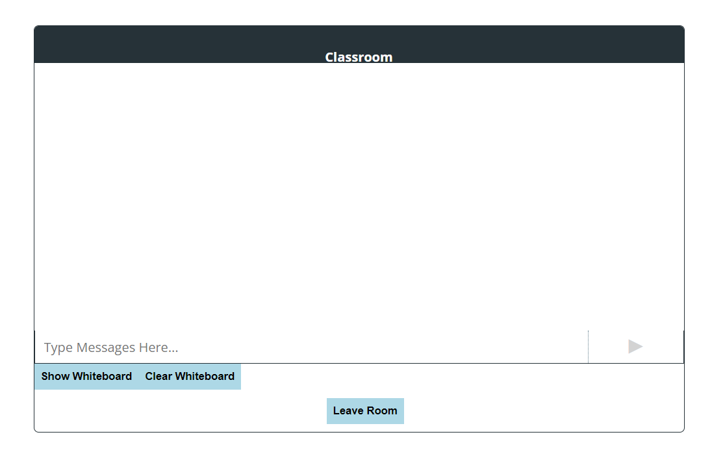

# CSC3104-Project Group 21
## How to start
### Prerequisites
- Docker
- Kubernetes (Docker desktop)

### Windows Configuration
To build the docker image, run the following command in the root directory of the project:
```
cd cloud\classroom
apply.bat
```
To build the kubernetes server, run the following command in the root directory of the project:
```
cd cloud\backend
apply.bat
```
To build the kubernetes client, run the following command in the root directory of the project:
```
cd cloud\client
apply.bat

```

### Mac Configuration
To build the docker image, run the following command in the root directory of the project:
```
cd cloud/classroom
bash apply.sh
```
To build the kubernetes server, run the following command in the root directory of the project:
```
cd cloud/backend
bash apply.sh
```
To build the kubernetes client, run the following command in the root directory of the project:
```
cd cloud\client
bash apply.sh
```

Now when you run `kubectl get all` you should see the following:


### Usage

#### Classroom
With the kubernetes server and client running, you can access the classroom by going to `localhost:30000/`


Select your language and language to learn from the dropdowns and click `Join A Room`


You will be redirected to a waiting page where you will wait for another user to join the room.


For the purposes of this demo, you will need to open another browser window and go to `localhost:30000/` and select the opposite languages as the first user.


Once the second user joins the room, you will be redirected to the classroom page.



If you view the running containers in Docker Desktop, you will see the a container for the classroom would have been created.


#### Translation

To send a translated message, click on the 'Translate?' button and the messages you send will be translated to the language you are learning.


#### Classroom scaling

If you repeat the steps above to make another classroom, you will notice a new container with a different port is created for the new classroom.


#### Stress testing HPA
To stress test the HPA functionality of the client pod, run the following commands:
```
pip install locust
cd cloud/client
locust
```
Then go to `localhost:8089` and enter the following values:
```
Number of total users to simulate: 100
Hatch rate (users spawned/second): 10
Host: http://localhost:30000
```
When you click `Start swarming`, you will see the number of users increase to 100 and the CPU usage of the client pod increase and scale according to the number of users.
```
kubectl get hpa
```

#### Stress testing classroom creation
To stress test the classroom creation functionality of the backend pod, run the following commands:
```
pip install locust
cd cloud/backend
locust
```
Then go to `localhost:8089` and enter the following values:
```
Number of total users to simulate: 1
Hatch rate (users spawned/second): 1
Host: http://localhost:30001
```
When you click `Start swarming`, you will see the number of users increase to 100 and the CPU usage of the backend pod increase and scale according to the number of users.
```
kubectl get hpa
```